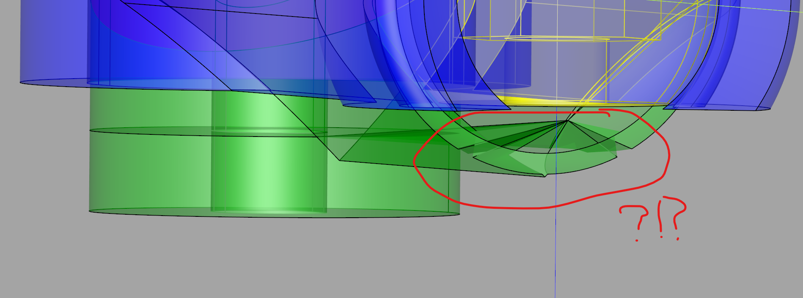

# CadQuery Bug Note

This branch of the "Magic Arm" repository tracks a CadQuery oddity I want to
investigate later.

The green object is the actuating arm, and it is supposed to be split at
the same cutoff height as the yellow and blue parts. But while the split
operation was successful for yellow and blue parts, the green split resulted
in bad geometry where the unwanted part is still visible and introduced jagged
unwanted geometry.
